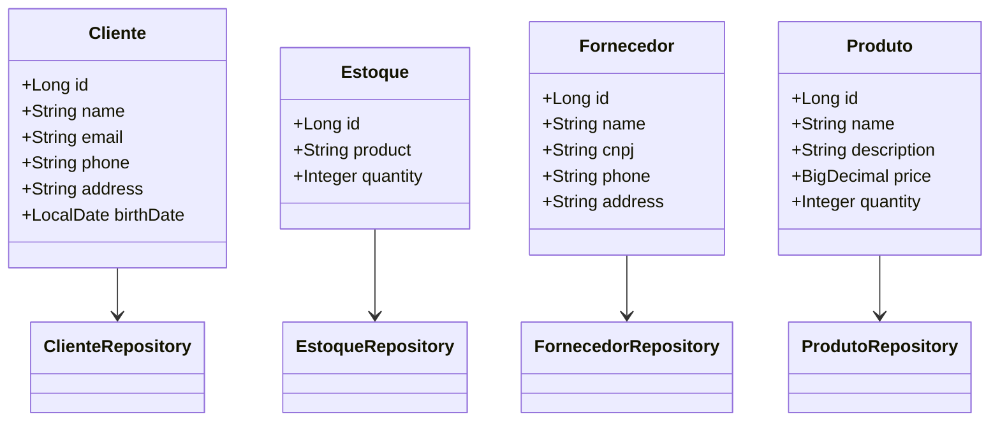

[🇧🇷](README.md)

# ArtCraft Project

## Description

The ArtCraft project is an ERP system for managing clients, suppliers, products, and inventory. It uses Spring Boot for
the backend and includes a RESTful API with CRUD operations. The frontend is developed with HTML, CSS, and JavaScript.
The application is configured to be deployed on Railway, and there are plans for frontend improvements, exception
handling, and controller adjustments.

**NOTE:** As this project is exclusively for my wife's creative stationery business, I insist that the project be kept
entirely in Portuguese. I will not compromise on this, as the project is not for me, but for her.

## Project Structure

```
src/main/java/com/ArtCraft
├── controller
│   ├── api
│   │   ├── ClienteApiController.java
│   │   ├── EstoqueApiController.java
│   │   ├── FornecedorApiController.java
│   │   └── ProdutoApiController.java
│   └── web
│       ├── ClienteWebController.java
│       ├── EstoqueWebController.java
│       ├── FornecedorWebController.java
│       └── ProdutoWebController.java
├── exceptions
│   └── (vazia ainda)
├── model
│   ├── Cliente.java
│   ├── Estoque.java
│   ├── Fornecedor.java
│   └── Produto.java
├── repository
│   ├── ClienteRepository.java
│   ├── EstoqueRepository.java
│   ├── FornecedorRepository.java
│   └── ProdutoRepository.java
├── service
│   └── (vazia ainda)
src/main/resources/static
├── css
│   ├── botao_financeiro.css
│   ├── botao_upper.css
│   ├── cliente.css
│   ├── efeito_hover.css
│   ├── efeito_pressed.css
│   ├── fornecedor.css
│   ├── hand.css
│   ├── MainView.css
│   └── vier_all.css
├── img
│   └── (vazia ainda)
├── js
│   ├── jquery-3.6.0.min.js
│   └── script.js
src/main/resources
├── templates
│   ├── cliente_detail
│   ├── clientes.html
│   ├── clientes_form.html
│   ├── estoque.html
│   ├── estoque_detail.html
│   ├── estoque_form.html
│   ├── fornecedor_detail.html
│   ├── fornecedor_form.html
│   ├── fornecedores.html
│   ├── index.html
│   ├── main_view.html
│   ├── produto_detail.html
│   ├── produto_form.html
│   └── produtos.html
```

## Implemented Features

### Backend

- **Controllers**
    - `ClienteApiController`: Manages CRUD operations for clients via REST API.
    - `EstoqueApiController`: Manages CRUD operations for inventories via REST API.
    - `FornecedorApiController`: Manages CRUD operations for suppliers via REST API.
    - `ProdutoApiController`: Manages CRUD operations for products via REST API.
    - `ClienteWebController`: Manages CRUD operations and visualization for clients via web interface.
    - `EstoqueWebController`: Manages CRUD operations and visualization for inventories via web interface.
    - `FornecedorWebController`: Manages CRUD operations and visualization for suppliers via web interface.
    - `ProdutoWebController`: Manages CRUD operations and visualization for products via web interface.

- **Models**
    - `Cliente`: Includes attributes like `id`, `name`, `email`, `phone`, `address`, and `birthDate`.
    - `Estoque`: Includes attributes like `id`, `product`, `quantity`.
    - `Fornecedor`: Includes attributes like `id`, `name`, `cnpj`, `phone`, `address`.
    - `Produto`: Includes attributes like `id`, `name`, `description`, `price`, `quantity`.

- **Repositories**
    - `ClienteRepository`
    - `EstoqueRepository`
    - `FornecedorRepository`
    - `ProdutoRepository`

- **Swagger/OpenAPI**
    - API documentation with Swagger/OpenAPI for `Produto`, `Cliente`, `Estoque`, `Fornecedor`.

### Frontend

- Basic structure with configured CSS and JS.
- HTML templates for displaying and interacting with data, including pages for clients, suppliers, products, and
  inventories.

## Future Implementations

1. **Publishing the API online on Railway:**
    - Configuration and deployment of the application on Railway for online access.

2. **Frontend Improvement:**
    - Styling and enhancement of the user interface with CSS and JavaScript.
    - Inclusion of new components and interactions to improve the user experience.

3. **Creating Exceptions:**
    - Implementation of an exception package for proper error handling in the application.
    - Addition of classes to manage specific errors and ensure consistent API responses.

4. **Controller Class Fixes:**
    - Adjustment and standardization of methods in controller classes to ensure compliance with best practices and
      RESTful standards.
    - Refactoring methods to improve efficiency and code readability.

5. **Adding Features:**
    - Implementation of new features as needed, such as financial management, financial reports, advanced inventory
      management functionalities, and integrations with other systems.
    - Improvement in application security, including user authentication and authorization.

## Class Diagram



## License

This project is licensed under the [MIT License](LICENSE).