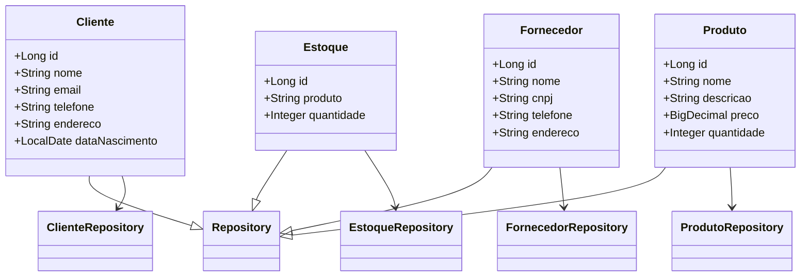

# Projeto ArtCraft

## Descrição

O projeto ArtCraft é um sistema de ERP para gerenciamento de clientes, fornecedores, produtos e estoques. Utiliza Spring
Boot para o backend e inclui uma API RESTful com operações CRUD. O frontend é desenvolvido com HTML, CSS e JavaScript. A
aplicação está configurada para ser implantada na Railway, e há planos para melhorias no front end, tratamento de
exceções e ajustes nos controladores.

**OBS:** Como esse projeto é destinado exclusivamente para a utilização da minha esposa para a papelaria criativa dela,
faço questão de que o projeto seja mantido totalmente em português. Não abrirei mão disso, pois o projeto não é para
mim, e sim para ela.

## Estrutura do Projeto

```
src/main/java/com/ArtCraft
├── controller
│   ├── ClienteController.java
│   ├── EstoqueController.java
│   ├── FornecedorController.java
│   └── ProdutoController.java
├── exceptions (vazia ainda)
├── model
│   ├── Cliente.java
│   ├── Estoque.java
│   ├── Fornecedor.java
│   └── Produto.java
├── repository
│   ├── ClienteRepository.java
│   ├── EstoqueRepository.java
│   ├── FornecedorRepository.java
│   └── ProdutoRepository.java
├── service (vazia ainda)
src/main/resources/static
├── css
│   └── botao_financeiro.css
│   └── botao_upper.css
│   └── cliente.css
│   └── efeito_hover.css
│   └── efeito_pressed.css
│   └── fornecedor.css
│   └── hand.css
│   └── MainView.css
│   └── vier_all.css
├── img (vazia ainda)
├── js
│   └── jquery-3.6.0.min.js
│   └── script.js
src/main/resources
├── templates
│   └── cliente.html
│   └── estoque.html
│   └── financeiro.html
│   └── fornecedor.html
│   └── index.html
│   └── produtos.html
```

## Funcionalidades Implementadas

### Backend

- **Controllers**
    - `ClienteController`: Adiciona, edita, exclui e lista clientes.
    - `EstoqueController`: Adiciona, edita, exclui e lista estoques.
    - `FornecedorController`: Adiciona, edita, exclui e lista fornecedores.
    - `ProdutoController`: Adiciona, edita, exclui e lista produtos.

- **Models**
    - `Cliente`: Inclui atributos como `id`, `nome`, `email`, `telefone`, `endereco` e `dataNascimento`.
    - `Estoque`: Inclui atributos como `id`, `produto`, `quantidade`.
    - `Fornecedor`: Inclui atributos como `id`, `nome`, `cnpj`, `telefone`, `endereco`.
    - `Produto`: Inclui atributos como `id`, `nome`, `descricao`, `preco`, `quantidade`.

- **Repositórios**
    - `ClienteRepository`
    - `EstoqueRepository`
    - `FornecedorRepository`
    - `ProdutoRepository`

- **Swagger/OpenAPI**
    - Documentação da API com Swagger/OpenAPI para `Produto`, `Cliente`, `Estoque`, `Fornecedor`.

### Frontend

- Estrutura básica com CSS e JS configurados.
- Templates HTML para exibição e interação com os dados.

## Futuras Implementações

1. **Publicação da API online no Railway:**
    - Configuração e deploy da aplicação na Railway para acesso online.

2. **Melhoria do Front End:**
    - Estilização e aprimoramento da interface do usuário com CSS e JavaScript.
    - Inclusão de novos componentes e interações para melhorar a experiência do usuário.

3. **Criação das Exceções:**
    - Implementação de um pacote de exceções para tratamento adequado de erros na aplicação.
    - Adição de classes para gerenciar erros específicos e garantir respostas consistentes da API.

4. **Correção das Classes Controllers:**
    - Ajuste e padronização dos métodos nas classes de controllers para garantir a conformidade com as boas práticas e o
      padrão RESTful.
    - Refatoração de métodos para melhorar a eficiência e a legibilidade do código.

5. **Adição de Funcionalidades:**
    - Implementação de novos recursos conforme necessário, como financeiro, relatórios financeiros, funcionalidades avançadas de
      gerenciamento de estoque e integrações com outros sistemas.
    - Melhoria na segurança da aplicação, incluindo autenticação e autorização de usuários.

## Diagrama de Classe



## Como Executar o Projeto

1. **Clone o Repositório:**

   ```bash
   git clone <URL_DO_REPOSITORIO>
   ```

2. **Navegue até o Diretório do Projeto:**

   ```bash
   cd ArtCraft
   ```

3. **Compile e Execute a Aplicação:**

   ```bash
   ./mvnw spring-boot:run
   ```

4. **Acesse a API:**
    - A API estará disponível em `http://localhost:8080/api`.

## Licença

Este projeto está licenciado sob a [Licença MIT](LICENSE).
